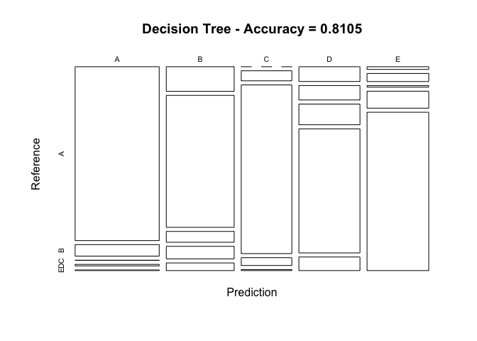
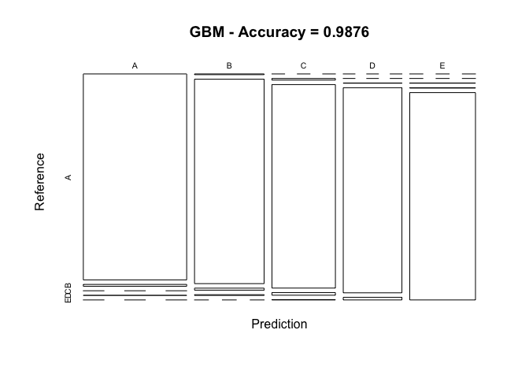
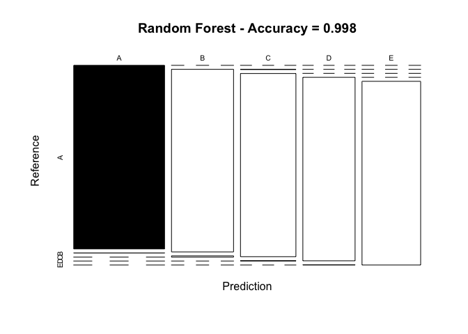

Executive Summary
=================

In this study, we analyzed the personal activity data which is provided
through devices such as *Jawbone Up*, *Nike FuelBand* and *Fitbit*.
Using all of the information, we were able to analyze various factors
which directly affect how well the person is completing their exercises.
The data was made available through their
[website](http://groupware.les.inf.puc-rio.br/har).

Numerous machine learning models were applied to this data set in order
to determine which one would best predict the type of activity that the
person was performing. We have determined that the **random forest**
machine learning model provided the most accurate results and have
applied that to our test data set in order to complete the study.

Exploratory Analysis
====================

Setup Environment
-----------------

Start by setting up the environment for analsis. In order to do this, we
need to do the following:

-   Load all of the necessary libraries
-   Have a consistent seed value - that way our results are reproducible
-   Retrieve the data from the source:
    -   [Training
        Set](http://d396qusza40orc.cloudfront.net/predmachlearn/pml-training.csv)
    -   [Testing
        Set](http://d396qusza40orc.cloudfront.net/predmachlearn/pml-testing.csv)
-   Cleanse the data

<!-- -->

    library(caret)

    ## Loading required package: lattice

    ## Loading required package: ggplot2

    library(rpart)
    library(rpart.plot)

    seed <- 19
    train.url <- 'http://d396qusza40orc.cloudfront.net/predmachlearn/pml-training.csv'
    test.url <- 'http://d396qusza40orc.cloudfront.net/predmachlearn/pml-testing.csv'

    train.data <- read.csv(
        url(train.url),
        na.strings = c('NA', '#DIV/0!', '')
    )

    test.data <- read.csv(
        url(test.url),
        na.strings = c('NA', '#DIV/0!', '')
    )

Now that the data has been loaded into memory, it is time to prepare it.

Prepare the Data
----------------

In order to get a good sense of how our models are able to predict the
results, we need to start by splitting our training data into two sets.
To do this, we split the **training** set into two sections, one that is
*70%* of the data, and the other which is *30%*.

After splitting the data, we will remove the first 5 columns as they do
not have anything to do with the predictions. This is because they are
the following:

-   `X`
-   `user_name`
-   `raw_timestamp_part_1`
-   `raw_timestamp_part_2`
-   `cvtd_timestamp`

<!-- -->

    set.seed(seed)

    # Partition the data for further analysis
    data.toTrain <- createDataPartition(train.data$classe, p = 0.7, list = FALSE)

    # Split the data set into the two portions
    data.train <- train.data[data.toTrain, ]
    dim(data.train)

    ## [1] 13737   160

    data.test <- train.data[-data.toTrain, ]
    dim(data.test)

    ## [1] 5885  160

    # Remove columns that we know will provide no value (names and timestamps)
    data.train <- data.train[, -(1:5)]
    data.test <- data.test[, -(1:5)]

Now that the data has been loaded, we need to first get rid of any data
that only have one unique value or have both of the following
characteristics (based on the near zero variance):

-   very few unique values relative to the number of samples
-   ratio of the frequency of the most common value to the frequency of
    the second most common value is large

<!-- -->

    data.nearZero <- nearZeroVar(data.train)
    data.train.cleaned <- data.train[,-data.nearZero]
    dim(data.train.cleaned)

    ## [1] 13737   123

    data.test.cleaned <- data.test[,-data.nearZero]
    dim(data.test.cleaned)

    ## [1] 5885  123

After looking at the data, we noticed that there were multiple `NA`
values which could affect the overall accuracy of the data. Because of
that, we will further reduce the columns based on whether or not the
data is mostly `NA`.

    # Grab a list where they are mostly "NA" values
    data.na <- sapply(
        data.train.cleaned,
        function(x) 
            mean(is.na(x))
    ) > 0.95

    # Filter out the data from both the training, and the test data sets
    data.train.cleaned <- data.train.cleaned[, data.na == FALSE]
    dim(data.train.cleaned)

    ## [1] 13737    54

    data.test.cleaned <- data.test.cleaned[, data.na == FALSE]
    dim(data.test.cleaned)

    ## [1] 5885   54

Now that the data is all tidied up, it is time to apply the various
models to it. This clean up left us with only **54** potential factors.

Train the Different Prediction Models
=====================================

In order to ensure we would have the most accurate predictions possible,
we will evaluate the following three machine learning techniques:

-   Decision Trees
-   Generalized Boosted
-   Random Forest

Decision Trees
--------------

Let's start by training the decision tree with the training data set.

    set.seed(seed)
    result.decision_tree.model <- rpart(
        classe ~ ., data = data.train
    )

Now that the model has been created, let's evaluate our results.

    result.decision_tree.predict <- predict(
        result.decision_tree.model,
        newdata = data.test,
        type='class'
    )

    result.decision_tree.confusion <- confusionMatrix(
        result.decision_tree.predict,
        data.test$classe
    )

    result.decision_tree.confusion

    ## Confusion Matrix and Statistics
    ## 
    ##           Reference
    ## Prediction    A    B    C    D    E
    ##          A 1410   93    1   12    5
    ##          B  161  864   71   82   50
    ##          C    0   49  823   38    5
    ##          D   87   85  122  731   80
    ##          E   16   48    9  101  942
    ## 
    ## Overall Statistics
    ##                                           
    ##                Accuracy : 0.8105          
    ##                  95% CI : (0.8003, 0.8205)
    ##     No Information Rate : 0.2845          
    ##     P-Value [Acc > NIR] : < 2.2e-16       
    ##                                           
    ##                   Kappa : 0.7612          
    ##  Mcnemar's Test P-Value : < 2.2e-16       
    ## 
    ## Statistics by Class:
    ## 
    ##                      Class: A Class: B Class: C Class: D Class: E
    ## Sensitivity            0.8423   0.7586   0.8021   0.7583   0.8706
    ## Specificity            0.9736   0.9233   0.9811   0.9240   0.9638
    ## Pos Pred Value         0.9270   0.7036   0.8995   0.6615   0.8441
    ## Neg Pred Value         0.9395   0.9409   0.9592   0.9513   0.9706
    ## Prevalence             0.2845   0.1935   0.1743   0.1638   0.1839
    ## Detection Rate         0.2396   0.1468   0.1398   0.1242   0.1601
    ## Detection Prevalence   0.2585   0.2087   0.1555   0.1878   0.1896
    ## Balanced Accuracy      0.9080   0.8409   0.8916   0.8411   0.9172

The overall accuracy of this model was: **81.05%**

For a breakdown of this approach, please refer to Appendix **Figure 1**
for a detailed breakdown of this plot.

Generalized Boosted
-------------------

Let's start by training the generalized boost with the training data
set.

    set.seed(seed)

    result.gbm.control <- trainControl(
        method = 'repeatedcv',
        number = 5,
        repeats = 1
    )

    # Did we already create the model?
    if(!exists('result.gbm.model')) {
        # We didn't, so let's train it
        result.gbm.model <- train(
            classe ~ .,
            data = data.train.cleaned,
            method = 'gbm',
            trControl = result.gbm.control,
            verbose = FALSE
        )   
    }

    ## Loading required package: gbm

    ## Loading required package: survival

    ## 
    ## Attaching package: 'survival'

    ## The following object is masked from 'package:caret':
    ## 
    ##     cluster

    ## Loading required package: splines

    ## Loading required package: parallel

    ## Loaded gbm 2.1.1

    ## Loading required package: plyr

Now that the model has been created, let's evaluate our results.

    result.gbm.predict <- predict(
        result.gbm.model,
        newdata = data.test
    )

    result.gbm.confusion <- confusionMatrix(
        result.gbm.predict,
        data.test$classe
    )

    result.gbm.confusion

    ## Confusion Matrix and Statistics
    ## 
    ##           Reference
    ## Prediction    A    B    C    D    E
    ##          A 1670   15    0    1    0
    ##          B    4 1116   11    4    0
    ##          C    0    8 1013   13    1
    ##          D    0    0    1  944   12
    ##          E    0    0    1    2 1069
    ## 
    ## Overall Statistics
    ##                                           
    ##                Accuracy : 0.9876          
    ##                  95% CI : (0.9844, 0.9903)
    ##     No Information Rate : 0.2845          
    ##     P-Value [Acc > NIR] : < 2.2e-16       
    ##                                           
    ##                   Kappa : 0.9843          
    ##  Mcnemar's Test P-Value : NA              
    ## 
    ## Statistics by Class:
    ## 
    ##                      Class: A Class: B Class: C Class: D Class: E
    ## Sensitivity            0.9976   0.9798   0.9873   0.9793   0.9880
    ## Specificity            0.9962   0.9960   0.9955   0.9974   0.9994
    ## Pos Pred Value         0.9905   0.9833   0.9787   0.9864   0.9972
    ## Neg Pred Value         0.9990   0.9952   0.9973   0.9959   0.9973
    ## Prevalence             0.2845   0.1935   0.1743   0.1638   0.1839
    ## Detection Rate         0.2838   0.1896   0.1721   0.1604   0.1816
    ## Detection Prevalence   0.2865   0.1929   0.1759   0.1626   0.1822
    ## Balanced Accuracy      0.9969   0.9879   0.9914   0.9883   0.9937

The overall accuracy of this model was: **98.76%**

For a breakdown of this approach, please refer to Appendix **Figure 2**
for a detailed breakdown of this plot.

Random Forest
-------------

### Train It

    set.seed(seed)

    result.random_forest.control <- trainControl(
        method='cv',
        number = 3,
        verboseIter = FALSE
    )

    # Did we already create the model?
    if(!exists('result.random_forest.model')) {
        # We didn't, so make it
        result.random_forest.model <- train(
            classe ~ .,
            data = data.train.cleaned,
            method = 'rf',
            trControl = result.random_forest.control
        )
    }

    ## Loading required package: randomForest

    ## randomForest 4.6-12

    ## Type rfNews() to see new features/changes/bug fixes.

    ## 
    ## Attaching package: 'randomForest'

    ## The following object is masked from 'package:ggplot2':
    ## 
    ##     margin

    result.random_forest.model$finalModel

    ## 
    ## Call:
    ##  randomForest(x = x, y = y, mtry = param$mtry) 
    ##                Type of random forest: classification
    ##                      Number of trees: 500
    ## No. of variables tried at each split: 27
    ## 
    ##         OOB estimate of  error rate: 0.21%
    ## Confusion matrix:
    ##      A    B    C    D    E  class.error
    ## A 3904    1    0    0    1 0.0005120328
    ## B    3 2651    3    1    0 0.0026335591
    ## C    0    5 2390    1    0 0.0025041736
    ## D    0    0    7 2245    0 0.0031083481
    ## E    0    0    0    7 2518 0.0027722772

Now that the model has been created, let's evaluate our results.

    result.random_forest.predict <- predict(
        result.random_forest.model,
        newdata = data.test.cleaned
    )

    result.random_forest.confusion <- confusionMatrix(
        result.random_forest.predict,
        data.test.cleaned$classe
    )

The overall accuracy of this model was: **99.80%**

For a breakdown of this approach, please refer to Appendix **Figure 3**
for a detailed breakdown of this plot.

Prediction
==========

Based on the various accuracies listed above, we have decided to use the
**random forest** model to predict the data that we expect to come out
of the testing data set.

    output <- predict(
        result.random_forest.model,
        newdata = test.data
    )

    output

    ##  [1] B A B A A E D B A A B C B A E E A B B B
    ## Levels: A B C D E

Appendix
========

  
 **Figure 1** - Decision Tree Results

  
 **Figure 2** - Generalized Boosted Results

  
 **Figure 3** - Random Forest Results
